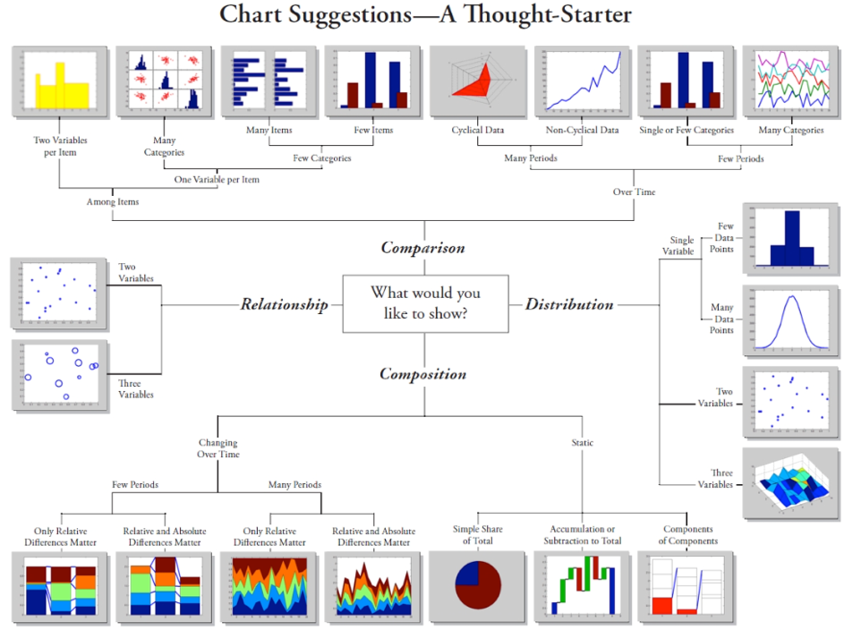
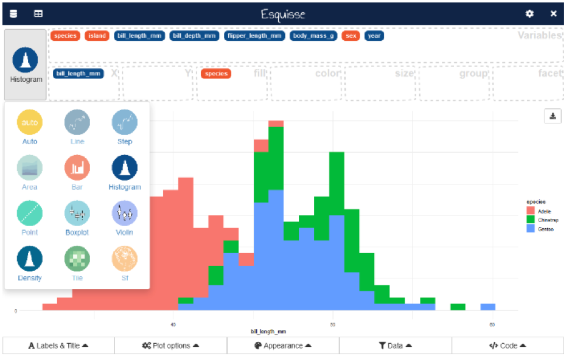
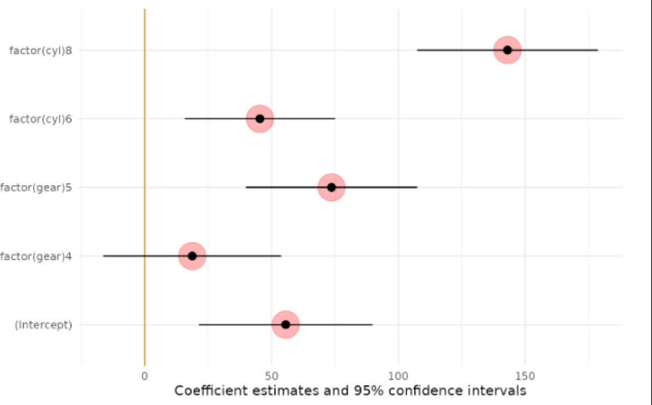

```{r setup, include=FALSE}
knitr::opts_chunk$set(echo = FALSE)
```

# Introduction

Scientific visualisation is classically defined as the process of graphically displaying scientific data (Tufte, 1983), often in the form of charts, graphs, and maps. By visualizing data in this way, students can more easily identify patterns and relationships, and gain insights that might not be immediately apparent from the raw data.

## *Objectives*

1. To show why **R** is so used and useful to explore the importance of data visualisation in introductory statistics and econometric courses. 
2. To provide practical tips and strategies for instructors looking to incorporate data visualisation into their courses.
3. Easy data visualisation with the packages `esquisse`, `modelsummary` and `ggstatplot` for graphical displays.

```{r types, echo=FALSE, fig.cap="Types of visual display", out.width = '100%'}

```

# Methods

The packages `esquisse` (Meyer & Perrier, 2023), `modelsummary` (Arel-Bundock, 2022) and `ggstatplot` allow to interactively explore data by visualizing it with the `ggplot2` package, a graphical user interface (GUI) for creating plots and charts in **R**. Is a useful tool for users who want to create visualisations in **R** but are not familiar with the syntax of **R**'s graphics packages. It can help to make the process of creating plots more intuitive and user-friendly.

## *The pedagogic approach to teaching graphics and data visualisation*

Students in introductory courses in business statistics from degrees of Business Administration, Tourism and the Double Degree in Labour Relations and Human Resources were required to create data visualisations with any of the packages mentioned before, for several scenarios and were given the option of selecting a case for interpretation. Databases such as *"Spanish Population and Demographic Data"*, *“Salaries and Labour Costs”*, the *"IBEX-35 Index"* and *“Real Estate Data”*, were chosen for the lesson. Students were graded based on their attendance and in-class assignments, which had to be completed by the end of the class.

# Results and feedback

The benefits of the training were emphasised in student comments and feedback from the end-of-semester course evaluation. Furthermore, students were allowed to assess their progress in statistics Table \@ref(tab:mytable2) depicts the findings of the evaluation.


```{r mytable2, out.width='70%'}
library(knitr)
library(kableExtra)

df <- data.frame(Descriptive1 = c("Descriptive\nstatistics", "Regression\nAnalysis", "Time Series\nAnalysis"),
                 Descriptive2 = c("8.45", "7.95", "8.25"),
                 Descriptive3 = c("8.71", "7.76", "8.67"),
                 Descriptive4 = c("8.88", "8.07", "8.37"),
                 Descriptive5 = c("8.89", "7.87", "8.05"))

knitr::kable(df, col.names = c("", "Identification and\nproblem solving", "Analytical\nskills", "Facilitate\ncomparison", "Interpretation and\ncritical thinking"), 
             escape = F, caption = 'Skill improvement assessment based on statistical subjects' , align = 'c', "html")
  
```

Students ranked 8.45, 8.71, 8.80, and 8.89 in the skill areas of identification and problem-solving, analytical skills, facilitate comparison and real-world data interpretation for this descriptive statistics course, respectively. Lower improvement showed in Regression Analysis and Time Series Analysis perhaps because of the difficulty of the concepts.

# Conclusions

Our findings suggest that the use of statistical software to create data visualisations helps students learn statistics concepts by providing alternative ways to represent data.  Especially, the use of the R software and in particular, its graphical environment which requires little programming knowledge for students allows them to learn statistical problem-solving and critical thinking through the creation of statistical plots. The use of graphical packages for data visualisation purposes like `esquisse`, `ggstatplot` and `modelsummary` has been configured to be very useful in this task.

According to the students’ feedback, the most useful and effective types of data visualisation for teaching introductory business statistics were: ***scatterplots***, ***bar charts/histograms***, ***box plots***, ***time series plots*** and ***heat maps***. 

Data visualisation can lessen difficulties in learning statistics and econometrics by providing opportunities to illustrate analytical findings in graphic form. The use of real-world data is to strengthen students' practical skills in these subjects and connect students to reality because providing opportunities to illustrate analytical findings in graphic form is essential for learners with different learning styles (Nolan & Perret, 2016) and (Hudiburgh and Garbinsky, 2020) 

```{r esquisse, echo=FALSE, fig.cap="User interface of the `esquisse` tool", out.width = '100%'}

```

```{r model, echo=FALSE, fig.cap=": graphical output of the `modelsummary` package", out.width = '100%'}

```

```{r, include=FALSE}
knitr::write_bib(c('knitr','rmarkdown','posterdown','pagedown'), 'packages.bib')
```

# Main References
Tufte, E. G. (1983): *The visual display of quantitative information*, Cheshire, Connecticut. Graphics Press. ISBN-9780961392147.

Meyer, F. and Perrier, V. (2023): *`esquisse`: Explore and Visualize Your Data Interactively*, [https://dreamrs.github.io/esquisse/](https://dreamrs.github.io/esquisse/)

Arel-Bundock, V. (2022). *`modelsummary`: Data and Model Summaries in R*, Journal of Statistical Software, 103(1), 1–23. [doi:10.18637/jss.v103.i01](doi:10.18637/jss.v103.i01).

Hudiburgh, L. M. and Garbinsky, D. (2020): *Data visualisation: Bringing data to life in an introductory statistics course*, Journal of Statistical Education, 28(3), pp. 262–279.

Nolan, D and Perrett, J. (2016): *Teaching and learning data visualisation: Ideas and assignments*, The American Statistician, 70(3), pp. 260–269.

